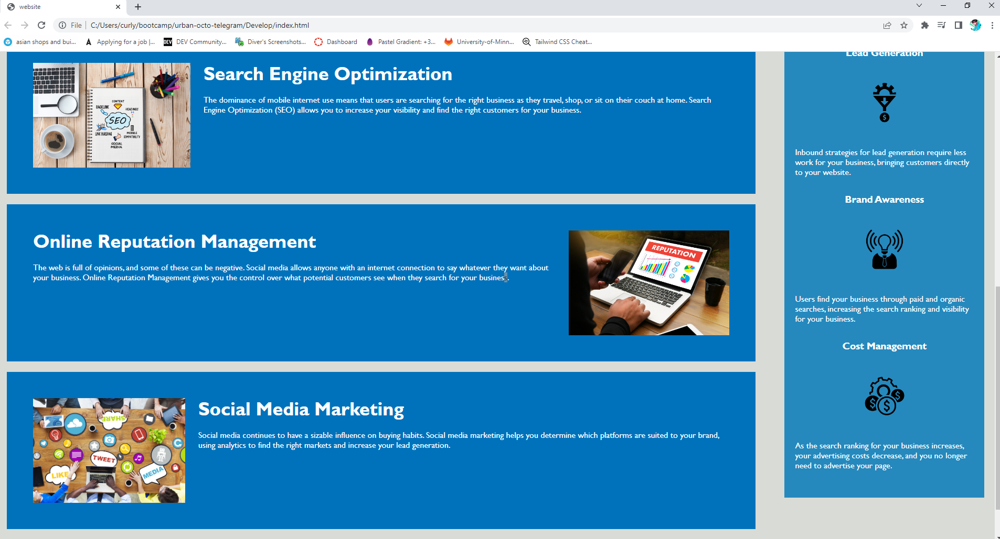

# Code Refactor Starter Code
## Description
The purpose of this assignment was to consolidate and reorganize the code, while also making the website more accessible for all users.

)

## links

https://kheprisol.github.io/accessability-homework/